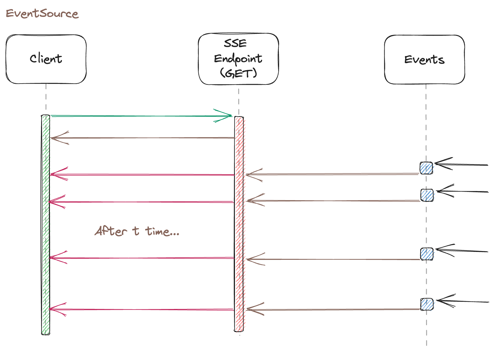
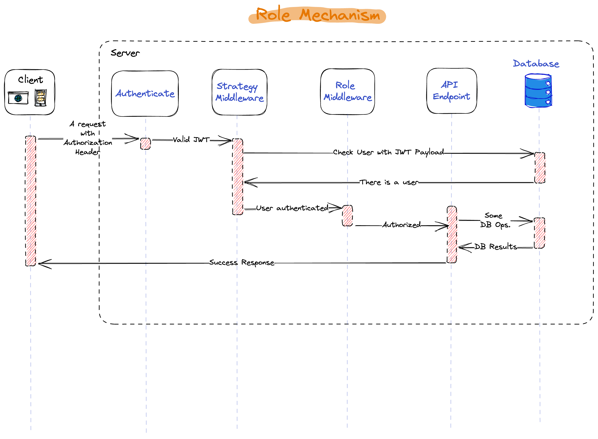
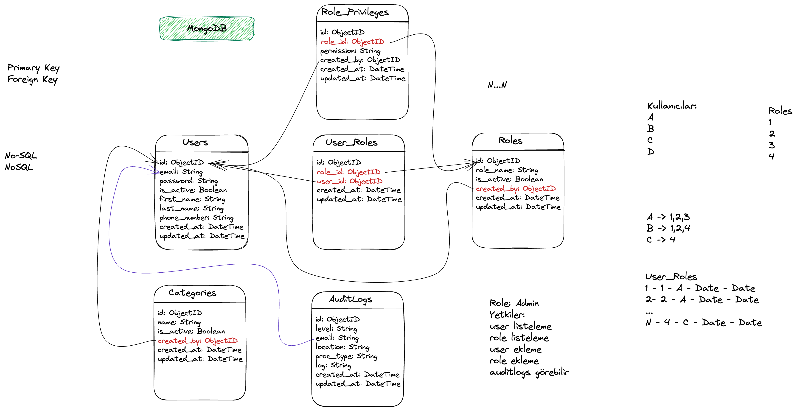
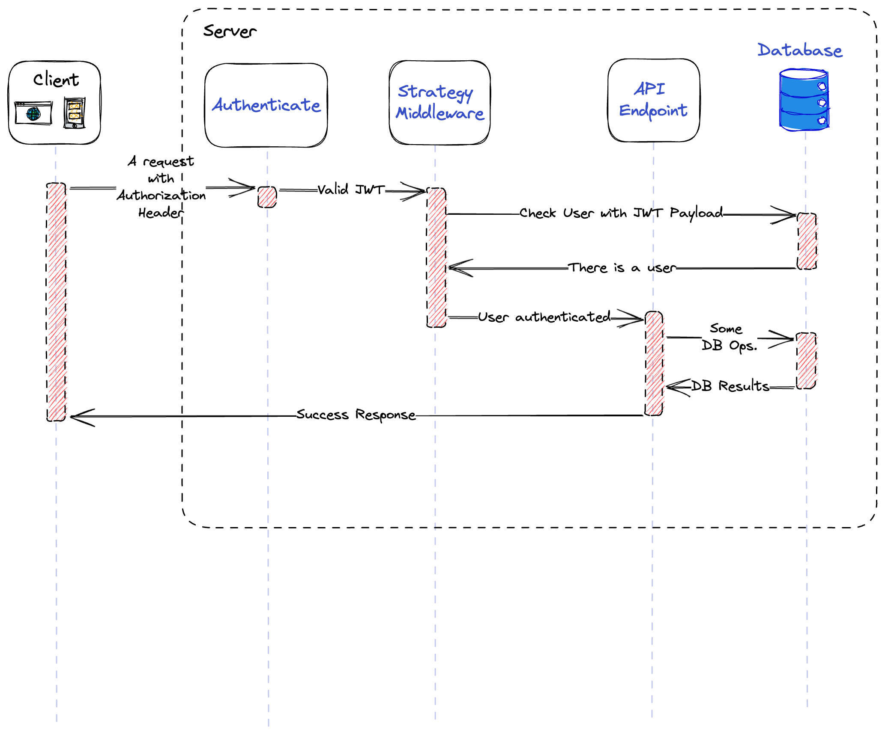

# Node.js Express MongoDB Backend Project

<p align="center">
  <strong>A RESTful API backend built with Node.js, Express, and MongoDB, designed with scalability, modular architecture, and production readiness in mind.</strong>
</p>

## 🏗️ System Architecture Overview

<p align="center">
    
</p>

<br>

# ⚙️ Tech Stack

- Node.js
- Express.js
- MongoDB + Mongoose
- REST API
- JWT Authentication
- ESLint + Prettier
- Postman Collection (Optional)

# About The Project

This project is a modular and scalable backend API built with Node.js, Express, and MongoDB. It follows RESTful principles and is structured with a focus on clean architecture and maintainability.

Designed for both learning and real-world usage, the project provides a solid foundation for developing modern web or mobile applications. Its structure allows easy extension for user management, authentication, and role-based access control.

It is ideal for:
- Web applications built with React, Angular, or Vue
- Mobile applications using React Native or Flutter
- Backend services requiring fast and reliable data operations


# About The Author
You can connect with me here:
* [Bora Akgul](https://borakgul.com) Coming Soon
* [E-mail](borakgul1@gmail.com)
* [Instagram](https://www.instagram.com/borakgul)

<br>
## 🔧 Key Features

- **Clean and Modular Codebase**: Project structure follows separation of concerns, making it easy to navigate, maintain, and scale as requirements grow.
- **Built with JavaScript & Express**: Focuses on simplicity while leveraging the power of Node.js for non-blocking, high-performance APIs.
- **MongoDB with Mongoose**: Uses Mongoose to model application data, ensuring schema consistency and simplifying database interactions.
- **Centralized Error & Response Handling**: Common patterns for sending responses and catching errors across routes and services.
- **Logging System**: Integrated logging for monitoring requests, responses, and errors using middleware — useful for debugging and observability.
- **Async/Await for Non-Blocking Operations**: All async operations are handled using async/await for cleaner and more readable code.
- **Docker Support**: Dockerfile included for seamless containerization and environment consistency during deployment.
- **Scalable Backend API**: Designed to serve multiple frontends (web or mobile) independently, with no direct coupling to any UI layer.
- **Ready for Production Use**: Includes best practices such as environment configuration, modular routing, and middleware usage.

> This backend can easily be extended to support authentication, authorization, caching (Redis), file upload, rate limiting, and more based on project needs.

## 📡 Server-Sent Events – One-Way Messaging

Server-Sent Events (SSE) allow a web page to automatically receive updates from the server over a single, long-lived HTTP connection.

Unlike traditional methods where the client repeatedly requests data, SSE enables the server to **push updates automatically** to the client.

**Common use cases include:**  
Facebook/Twitter updates, stock market updates, news feeds, sport results, etc.

<p align="center">
  
</p>
<br>

## 🔐 Role-Based Access Control (RBAC)
This project includes a role-based authorization mechanism to control access to protected resources. After a user logs in and receives a valid JWT token, the system checks both the user's identity and their assigned roles before allowing access to specific endpoints.

Key steps:

- The client sends a request with a JWT token in the Authorization header.

- The server authenticates the user and extracts role data.

- Role middleware verifies if the user has the necessary permissions.

- If authorized, the API executes the database operation and returns the result.

<p align="center">  </p>
<br>

## 🗃️ Database Design – MongoDB (NoSQL)

This project uses MongoDB with a well-structured, relational-like schema using references and embedded relationships to manage users, roles, and permissions.

Key Collections:

- Users: Stores user profile and login information.

- Roles: Defines user access roles (e.g., Admin, Editor).

- User_Roles: Manages many-to-many relationships between users and roles.

- Role_Privileges: Defines specific permissions per role.

- AuditLogs: Tracks user actions for transparency and debugging.

- Categories: Sample content-type collection linked to user actions.

- The model supports a flexible and scalable role-based access system, and is ideal for multi-user applications requiring fine-grained authorization.

<p align="center">  </p>

<br>

## 🔑 Authentication Flow (JWT Based)

This project uses JWT (JSON Web Token) for stateless authentication between client and server.

Flow Overview:

- The client sends a request with a JWT token in the Authorization header.

- The server verifies the token using authentication middleware.

- If the token is valid, user identity is confirmed.

- Authenticated users can access protected endpoints, which interact with the database.

- A response is returned based on the database query result.

- This flow ensures secure and scalable authentication without needing to store session data on the server.

<p align="center">  </p>
<br>

## You can find the complete API documentation [here](https://documenter.getpostman.com/view/34454707/2sB2j68ViL)

 ## JavaScript Destructuring Assignment

 This project makes extensive use of Destructuring Assignment, introduced in ES6, to simplify code structure and improve readability.
*  What is Destructuring ?
   Destructuring allows unpacking values from arrays or properties from objects into distinct variables in a concise way.
   
- Simplifies request parsing and object handling.

- Makes service and controller layers cleaner by extracting only needed values.

- Reduces boilerplate and improves maintainability.
  
   ```javascript 
   // Array Destructuring
  const [first, second, ...rest] = [1, 2, 3, 4, 5];
  
  // Object Destructuring
  const user = { id: 1, name: "Bora", role: "admin" };
  const { id, name } = user;;
    ```
 ##  How to Build and Run This Project
This project requires a running MongoDB instance and Node.js environment.

###  1. Clone the Repository

```bash
git clone https://github.com/borakgul/Node-express-mongo.git
cd Node-express-mongo/api
```
### 2. Install Dependencies

```bash
  npm install
```
### 3. Create `.env` File and Set Up Your Database

```bash
  MONGODB_URI=mongodb://localhost:27017/your-database-name
```
### 4. Start the API Server

```bash
  npm start
```
The backend API will be available at:
👉 http://localhost:3000

### License
```
  MIT License

Copyright (c) 2025 Bora AKGUL

Permission is hereby granted, free of charge, to any person obtaining a copy
of this software and associated documentation files (the "Software"), to deal
in the Software without restriction, including without limitation the rights
to use, copy, modify, merge, publish, distribute, sublicense, and/or sell
copies of the Software, and to permit persons to whom the Software is
furnished to do so, subject to the following conditions:

The above copyright notice and this permission notice shall be included in all
copies or substantial portions of the Software.

THE SOFTWARE IS PROVIDED "AS IS", WITHOUT WARRANTY OF ANY KIND, EXPRESS OR
IMPLIED, INCLUDING BUT NOT LIMITED TO THE WARRANTIES OF MERCHANTABILITY,
FITNESS FOR A PARTICULAR PURPOSE AND NONINFRINGEMENT. IN NO EVENT SHALL THE
AUTHORS OR COPYRIGHT HOLDERS BE LIABLE FOR ANY CLAIM, DAMAGES OR OTHER
LIABILITY, WHETHER IN AN ACTION OF CONTRACT, TORT OR OTHERWISE, ARISING FROM,
OUT OF OR IN CONNECTION WITH THE SOFTWARE OR THE USE OR OTHER DEALINGS IN THE
SOFTWARE.
